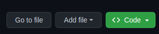
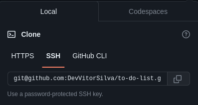
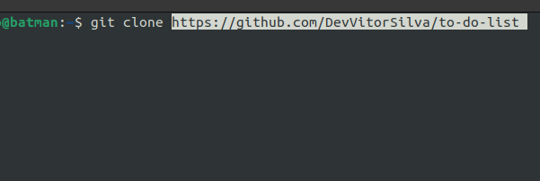
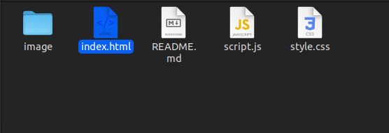
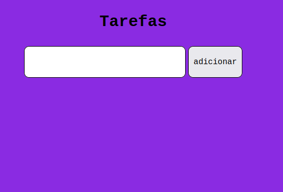
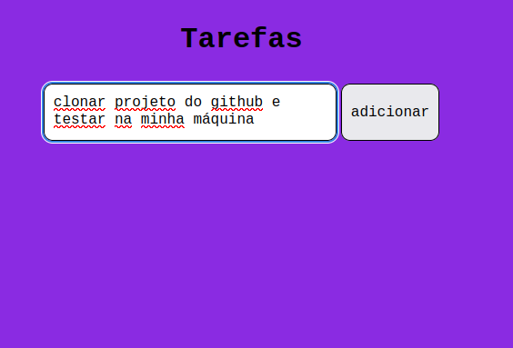
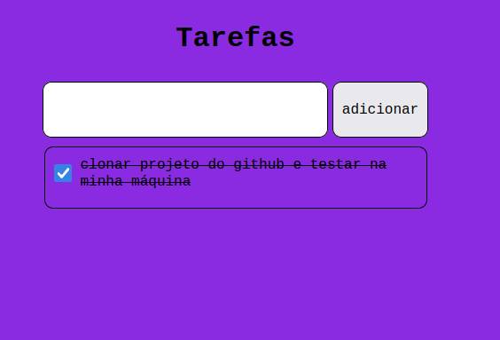

# to-do-list
[Teste o projeto aqui](https://devvitorsilva.github.io/todolist/)

To-do list sem conexão com banco de dados.

O objetivo deste projeto foi criar algo que me desafiasse a crescer como desenvolvedor.

### Funcionalidade do projeto
Poder adicionar uma lista de tarefas a serem feitas, e marca como concluidas.

### Tecnologias usadas
html, css e javascript.

### Como inicializar
1° Vá em code.



2° Copie a chave ssh ou https.



3° Abra seu terminal e digite ```git clone``` cole a chave ssh ou https do projeto.



4° Abra a pasta do projeto clonado, abra o arquivo index.html.



5° Essa é a imagem do projeto assim que você abri-lo em seu navegador favorito.



6° Para adicionar uma tarefa, basta digitar no campo de texto de apertar o botão adicionar.



7° Como fica a tarefa após adicionada.


8° Para marcar como concluida basta clicar na caixinha de checkbox ao lado da tarefa.



### Status do projeto
projeto concluido.